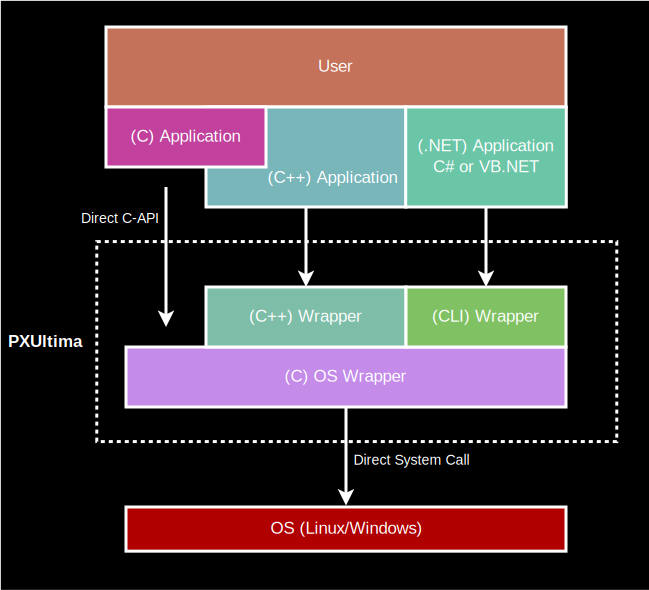

# PXUltima (POSIX Ultimatum) (Portable Operating System Interface ultimative version)

> :warning: [Warning] 
This project is currently "work in progress". 
Files are changed and moved very frequently. 
Current use of this project is not recommended, but possible.

## Structure

Same as the POSIX standard, this project shall be a wrapper API for any system to combines all special OS functions under the same name. 
Additionally, as this project tries not to rely on dependencies outside the OS (3rd party) and not even fully depend on the OS itself (2nd Party), we gain the possibility of semi backwards compatible behaviour.

We want to be able to fully use modern advancements in operating systems, but also make it possible to use even in restricted systems like embedded or legacy systems. This either works by using the recommended workaround or simply responding "Not supported" without any further restictions to still being able to use the rest.

## Content
- [C](Code/PXUltimaC/) Actual implementation of everything in this project
  - [Algorithm](Code/PXUltimaC/Algorithm) ...
  - [Compiler](Code/PXUltimaC/Compiler) Generic compiler for initial text analysis
  - [Container](Code/PXUltimaC/Container) List, Dictionary, BTree, QuadTree, ...
  - [Engine](Code/PXUltimaC/Engine) Basic engine to manage 2D-GUI or even full 3D applications. 
  - [Math](Code/PXUltimaC/Math) sin/cos, Matrix, Vector, ... 
  - [Media](Code/PXUltimaC/Media) Loading and saving PNG, JPEG, ...
  - [OS](Code/PXUltimaC/OS) File I/O,  Audio & Video, GUI, Networking, Debugging, ...
  - [Service](Code/PXUltimaC/Service) HTTP, FTP, LDAP, ...
- [C++](Code/PXUltimaCPP/) C++ wrapper to ease C syntax and/or access C-DLL
  - ... 
- [C#](Code/PXUltimaCS/) Wrapper to access C-DLL
  - ... 
- Java Wrapper to access C-DLL
  - ... 

## Systems
| OS | Windows | Linux (Mint) | OSX |
|:--:|:--:|:--:|:--:|
| x86 (32-Bit) | :heavy_check_mark:  | :heavy_check_mark:  | :x: |
| x64 (64-Bit) | :heavy_check_mark: | :heavy_check_mark:  |:x: |
|ARM32| :x:  | :x: |:x: |
|ARM64| :x:  | :x: |:x: |

> I do not own any Apple device nor ARM based CPU systems. They can not be testet by me right now.

## Supported Formats
<table>
<tr>
  <th>Image</th>
  <th>Objekt</th>
  <th>Sound</th>
  <th>Video</th>
</tr> 
  
 </td><td valign="top">
  
| Format | Supported |
|:--:|:--:|
| BMP | :heavy_check_mark: | 
| GIF | :x: |
| PNG | :heavy_check_mark:|
| JPEG | :heavy_check_mark: |
| TGA | :heavy_check_mark: |
| TIFF | :x: |
    
 </td><td valign="top">

| Format | Supported |
|:--:|:--:|
| 3DS | :x: |
| FBX | :x: |
| OBJ | :heavy_check_mark: | 
| PLY | :x: |
| STL | :x: |
| WRL | :x: |
| STEP | :x: |

 </td><td valign="top">
 
| Format | Supported |
|:--:|:--:|
| AAC | :x: |
| FLAC | :x: |
| MID | :warning: |
| MP3 | :x: |
| OGG | :x: |
| WAV | :heavy_check_mark: |
| WMA | :x: |
  
</td><td valign="top">
  
| Format | Supported |
|:--:|:--:|
| AVI | :x: |
| MP4 | :x: |
  </td>
 </table>
 

## Test Systems
| OS | CPU | RAM | GPU | Does it run? |
|:--|:--|--:|:--|:--:|
|Windows 10 (x64)|AMD Ryzen 9 7950X3D |32GB DDR5| Nvidia GTX 1080 | :heavy_check_mark:|
|Windows 10 (x64)|Intel i7 6400k|32GB DDR4| Nvidia GTX 970 | :heavy_check_mark:|
|Windows 10 (x64)|Intel i3 2300M|4GB DDR3| Intel HD 3000 | :heavy_check_mark:|
|Windows 7 (x64)|Intel Pentium IV 3GHz|3GB DDR2|???|:heavy_check_mark:|
|Windows XP (x86)|AMD Sempron |1GB DDR1|Nvidia FX5200 (64-Bit)| :heavy_check_mark:|
|Windows XP (x86)|Intel Pentium II 233MHz|128MB SDRAM|Matrox G100|:heavy_check_mark:|
|Windows 2000 (x86)|???|???|???|:heavy_check_mark:|
|Windows 98 SE (x86)|Intel Pentium 90 MHz|16MB EDORAM|S3 Trio32|:x:|

